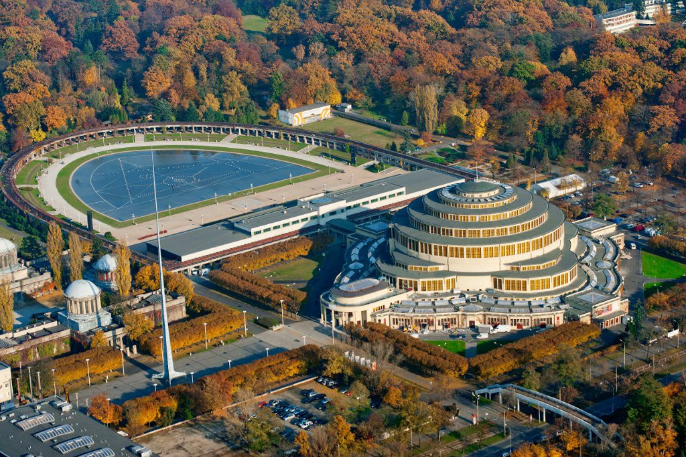
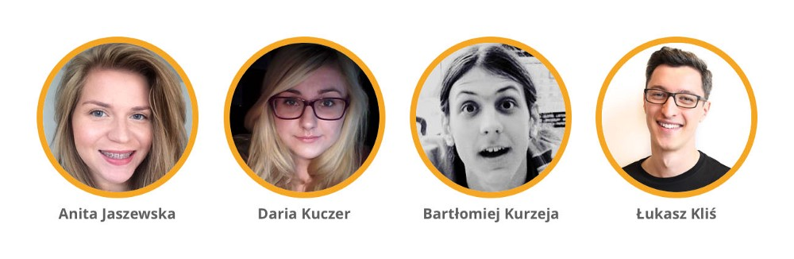
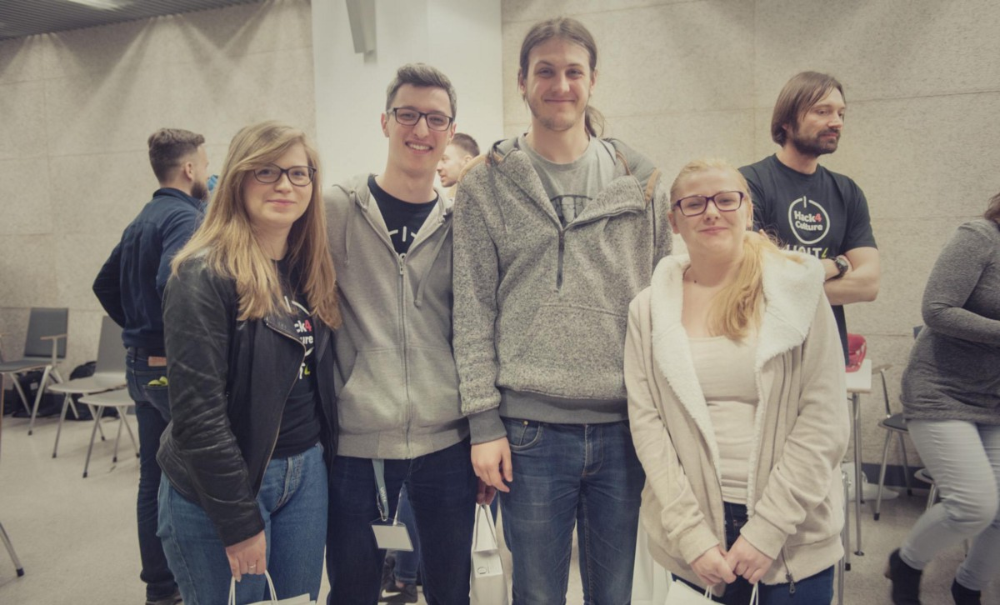

Last week I took part in [Hack4Culture][hack4culture]— an overnight hackathon in Wrocław. The event was all about culture. Sixteen teams have been working on combining technology with culture on Friday & Saturday.

## Location

[Wrocław](https://www.wroclaw.pl/) — a lovely city in Poland with plenty of cultural events and more. I highly recommend visiting it in case when you hadn’t had a chance yet. You won’t regret it. ;) There is only one thing I can advice against is commuting by car. Unfortunately I decided to do that and ended up maneuvering in a maze of one way streets in the city center.

The hackathon took place in a Conference Center next to the Centennial Hall. It’s a huge structure built in the beginning of the 20th century.

## Hackathon

The event started around 4pm with a registration. After picking up the starter kit (a pen, a notebook, a t-shirt, and a power bank), we went towards the designated for our team desk. One by one, other teams kept showing up, slowly filling up all of the available spots. Each of the teams was up to four people. In the end, according to what organisers said, around 60 people were eager to spend the entire night on coding.

Before the hackathon started, Bartek approached our desk asking if Anita & me would be up for merging two, two-persons teams. We’ve happily agreed to that, and after short presentations from speakers we started discussing what we could do together as a team.

## The Team

Our team — “Cluster of Disaster” — had four members:

## The Idea

All of us wanted to build something simple and useful for the users. Despite all of the previous ideas Anita and me had in the car on the way to Wrocław, we decided to build something different. Something the entire team wants to create. After a short discussion, we came up with an idea of tindart–Tinder-alike app for culture.

The goal of the project was simple: suggest the user which exhibitions she/he should go to, that match her/his preferences.

How could we do that? The first thing we thought of was defining what kind of features we want to have as part of a [MVP](https://en.wikipedia.org/wiki/Minimum_viable_product).

## Defining the MVP

Having a MVP defined [is important](https://en.wikipedia.org/wiki/Minimum_viable_product#Purposes). Not only when it comes to projects built on hackathons, but also in general. Defining a list of **absolutely necessary** features allows you to **deliver value on time**. And time is crucial. It helps you **stay focused**, and not worrying about if you can write all of the code on time, prepare the pitch, and/or have a power nap in the meantime. You should also keep in mind **it’s important to choose the right tools** with which you want, or can work. **On a hackathon you should make sure to focus on the product development, and not on building the toolset around it.**

In case of our project, we came up with the following set of **MUST HAVE** features:

- a simple landing page encouraging the user to explore the product
- sign in/sign up
- ability to rate some of dozens of paintings (if you like it, or not)
- displaying a suggestion to the user with a museum and an exhibition that suits the user based on her/his ratings
- matching users with similar preferences

After we knew what to do, we could finally start to work.

## Choosing the Right Tools

When it comes to the choice of technology, we didn’t want to spend too much time on finding out if _framework X_, or _language Y_ can work for us. We wanted to pick something with what the most of us has the most of experience.

Anita works as a back-end developer with [Ruby](https://www.ruby-lang.org/) & [Ruby on Rails](http://rubyonrails.org/). I work as a front-end developer. The other two (Daria & Bartek) used to work with many different languages and technologies during their studies (they’re both studying Computer Science). However, both of them were opened for new challenges, and it turned out Ruby would be a such thing.

We decided to use a simple stack that just works. We picked Ruby & Ruby on Rails for the back-end (SQLite in the development environment, and PostgreSQL on production), [Haml](https://haml-lang.com) & [SCSS](https://sass-lang.com) with the support of [BEM](http://bem.info/) on the front-end. Everything was supposed to be deployed via a simple “git push heroku master” to an instance on [Heroku](http://heroku.com/). The entire codebase was stored in [a repository on GitHub](https://github.com/tindart/tindart).

## Development

Our first commit was pushed to the “master” branch on Friday at 6:41pm. Daria designed a nice, simple logo, Anita & Bartek focused on preparing models, and I started working on the front-end part.

More time passed, more commits were pushed to master. Eventually, around 9pm, we made a short break to grab a couple of slices of pizza.

All of the teams were working hard on achieving their goals. You could hear them talking, sometimes even arguing. Somewhere close, you could hear fingers clicking little buttons on the keyboards. You hoped they got mechanical ones, so they wouldn’t have to get new ones after this night.

_Tick tock. Tick tock._ The clock is ticking.

Our team worked intensively on making sure all of the MVP features are there. Around 2am I had a small crisis, and I had to take a short power nap to re-generate my body and mind. Thanks to the organisers for providing poufs with blankets. They were quite handy. :)

Finally, the morning came. Around 6am almost everything was ready. We only had to apply some styling to a couple of elements, run some manual tests on “production”, and prepare a pitch. Up to 5 minutes to present Who, What, Why, and demo the project in front of everyone. Jury, mentors, organisers, other teams, and invited guests.

## Pitching the Ideas

As soon as organisers’ watches showed eleven o’clock, the time has come to present on what the teams have been working on for the past 20 hours. As mentioned earlier, **sixteen teams** were supposed to pitch their ideas. Each of the teams spent around five minutes talking what they have built, which technologies they have used, and demoing the prototypes of the ideas they had.

Time has come for our team. All of us went on stage. Anita perfectly pitched our idea to the crowd, and showed a live demo of [tindart][tindart]. We were lucky. We picked Heroku as a hosting provider: a free plan, one dyno, 18 hours uptime/day. We forgot about the last part—“18 hours uptime/day”. We set up an account shortly after the first commit without thinking of possible consequences. **If the demo would be delayed by half an hour, we would not be able to show the project live.** Of course, we could have still showed the project locally, but it wouldn’t be the same.

## Choosing the Best Projects

[The jury](http://hack4culture.pl/#jury) was made of five people with different backgrounds. Everyone of them rated each of the projects based on the following criteria: innovation, design, functionality, and the business potential/usability.

**All of the presented projects were really interesting.** Moreover, all of the teams were pitching their ideas as they were professionals. You could see their pride and passion about the applications/tools they created.

After all of the pitches ended, the jury gathered to choose the best project of this year’s edition of [Hack4Culture][hack4culture].

## Rewards

Our team believes hackathons are not to compete with each other and to win something, but **to have some fun, meet some new, interesting people, and prove it’s possible to build a prototype of a product in less than 24 hours**. Also, to work with technologies you might not be the most familiar with. ;)

In this hackathon, the authors of the best idea according to the jury, could win a Microsoft Surface 3 tablet (with keyboard) and an Apple Watch (model Sport, black) for each of the team members. Additionally, there was an additional reward from Microsoft: a Raspberry Pi 3 for each of the team members. Last, but not least, the audience award: a Kindle Touch e-reader for each of the team members.

Before the pitches, the organisers decided to split the main reward between two team in case when they’ll have two teams between which they can’t choose a better one.

Really nice rewards to win, aren’t they?

## The Verdict

After a couple of minutes for the jury, the decision has been made.

The audience award went to the “Allegro” team for their “Kubot” project (a bot for Facebook Messenger informing about local cultural events).

The Microsoft award went to the Mippit team for their “Prowizorka” project (a mobile app informing about the street art events nearby with a possibility to e-donate the performers). Congratulations! A really nice idea!

**The second place went to our project—[tindart][tindart]!** All four of us couldn’t believe what we have just heard. The jury liked our project. The project we have done in less than 24 hours, with a minimal set of features, with minimal design. Each of us got a brand new Apple Watch Sport (black coloured) as a reward. As mentioned earlier, no one from our team came here to win something, but just to have fun. It was a very nice surprise, nevertheless. ;)

The first place went again, to the “Allegro” team (“Kubot” project). All of the team members got a brand new Microsoft Surface 3 tablet with an additional keyboard. I was very happy to see that, Kubot was my personal favourite. I use Facebook Messenger quite often, and I wish to have such a bot available for public use. Kudos! Well done!

---

It was a first overnight hackathon I attended. I’m not quite sure if I should do it again, since I was struggling a lot with lack of sleep during the night. Exactly 6 months earlier, together with Anita I won the third place in a “Hack Like a Girl” hackathon in Berlin with the Wunschconcert project.

Hack4Culture was an event that offered a lot of fun, new contacts, and personally make me feel closer to the culture & art. I would like to thank all of the organisers, sponsors, jury, mentors, and participants for a really good work in order to make this event happen. Special thanks to the beloved Cluster of Disaster team: Anita, Daria & Bartek. Our team decided to continue working on the project in the future. I will keep you posted. :)

It’s been a very long, and tiring weekend. Now it’s time to catch some breath and rest. ;)

[hack4culture]: https://hack4culture.pl/en/
[tindart]: https://tindart.herokuapp.com/
